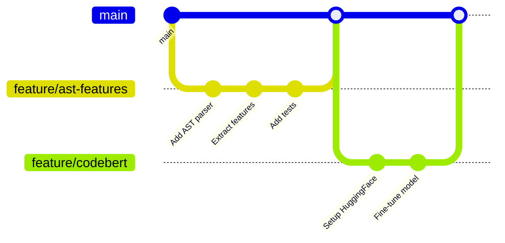

# 🤝 Contributing Guide

## Quick Start

1. **Pick a task** from GitHub Issues
2. **Create a branch** with naming: `<type>/<description>`
3. **Make changes** and test locally
4. **Commit and push** with clear messages
5. **Open a Pull Request** using the template

---

## Git Workflow



### Branch Naming Convention

```bash
feature/ast-features      # New features
fix/data-loader-bug       # Bug fixes
docs/contribution-guide   # Documentation
experiment/xgboost        # Experiments
refactor/clean-pipeline   # Code refactoring
test/add-coverage         # Adding tests
```

---

## Step-by-Step Process

### 1. Pick a Task
- Browse GitHub Issues
- Look for difficulty labels: `beginner`, `intermediate`, `advanced`
- Choose based on your skill level

### 2. Create Branch
```bash
git checkout main
git pull origin main
git checkout -b feature/your-task-name
```

### 3. Make Changes
- Write code following project style
- Add tests for new functionality
- Update documentation if needed

### 4. Test Locally
```bash
# Run all tests
./run_all_tests.sh

# Test your specific changes
python3 src/pipeline.py train --task A
python3 tests/test_your_feature.py
```

### 5. Commit & Push
```bash
git add .
git commit -m "Add: brief description of changes"
git push origin feature/your-task-name
```

**Commit message format:**
- `Add: new feature or file`
- `Fix: bug fix`
- `Update: modify existing code`
- `Docs: documentation changes`
- `Test: add or update tests`

### 6. Create Pull Request
- Go to GitHub and open a Pull Request
- Fill out the PR template
- Request review from team members
- Address review comments

---

## Pull Request Template

When you open a PR, include:

```markdown
## Description
Brief description of what this PR does

## Type of Change
- [ ] ⭐ Beginner (documentation, simple features)
- [ ] ⭐⭐ Intermediate (model experiments, advanced features)
- [ ] ⭐⭐⭐ Advanced (transformers, novel research)

## Changes Made
- Change 1
- Change 2
- Change 3

## Testing
- [ ] Ran existing tests: `./run_all_tests.sh`
- [ ] Added new tests
- [ ] Tested manually

## Performance Impact (if applicable)
- Baseline F1: X.XX%
- New F1: X.XX%
- Improvement: +X.XX%

## Checklist
- [ ] Code follows style guidelines
- [ ] Added documentation
- [ ] Tests pass
- [ ] Updated README if needed
- [ ] No merge conflicts
```

---

## Code Style Guidelines

### Python
- Follow PEP 8
- Use type hints where possible
- Add docstrings to functions
- Keep functions small and focused

### Example
```python
def extract_features(code: str) -> dict:
    """
    Extract features from code
    
    Args:
        code: Source code string
        
    Returns:
        dict: Feature name -> value mapping
    """
    features = {}
    # Your code here
    return features
```

---

## Adding Features

### 1. Create Your Feature File
```bash
cp src/features/_template.py src/features/yourname_features.py
```

### 2. Implement Your Features
```python
# src/features/yourname_features.py

def extract_yourname_features(code: str) -> dict:
    """Your feature extraction logic"""
    return {
        'feature_1': calculate_something(code),
        'feature_2': count_something(code),
    }
```

### 3. Register Your Features
Edit `src/features/__init__.py`:
```python
# Add import
from .yourname_features import extract_yourname_features

# Add to extract_all_features()
def extract_all_features(code: str) -> dict:
    features = {}
    features.update(extract_basic_features(code))
    features.update(extract_keyword_features(code))
    features.update(extract_yourname_features(code))  # ← Add this
    return features
```

---

## Adding Models

### 1. Create Your Model File
```bash
cp src/models/_template.py src/models/yourname_model.py
```

### 2. Implement Your Model
```python
# src/models/yourname_model.py

class YourNameModel:
    def __init__(self, **kwargs):
        # Initialize your model
        pass
    
    def fit(self, X, y):
        # Train your model
        return self
    
    def predict(self, X):
        # Make predictions
        return predictions
```

### 3. Register Your Model
Edit `src/models/__init__.py`:
```python
# Add import
from .yourname_model import YourNameModel

# Add to get_model()
def get_model(model_type: str, **kwargs):
    if model_type == 'yourmodel':
        return YourNameModel(**kwargs)
    # ... existing code
```

---

## Code Review Guidelines

### As a Reviewer
- Be constructive and respectful
- Check for code quality and tests
- Verify performance claims
- Suggest improvements, don't demand perfection

### As an Author
- Respond to all comments
- Make requested changes or explain why not
- Be open to feedback
- Thank reviewers for their time

---

## Questions?

- **Stuck?** Ask in GitHub Issues or team chat
- **Bug?** Open an issue with `bug` label
- **Idea?** Open an issue with `enhancement` label

---

See [README.md](README.md) for project overview and [RESEARCH.md](RESEARCH.md) for research direction.
