# SemEval 2026 Task 13 - Machine-Generated Code Detection
## Student Research Project - Complete Guide

> **Research Goal:** Develop high-performance models to distinguish human-written code from AI-generated code  
> **Competition:** [SemEval 2026 Task 13](https://github.com/mbzuai-nlp/SemEval-2026-Task13)  
> **Evaluation Period:** January 10-24, 2026  
> **Paper Deadline:** February 2026  
> **Target:** 90%+ Macro F1 Score

[](https://www.python.org/downloads/)
[](https://opensource.org/licenses/MIT)

---

## 📊 Training Data Overview

**Official Dataset:** Provided by SemEval 2026 Task 13 organizers

| Task | Description | Classes | Training Samples | Languages |
|------|-------------|---------|------------------|-----------|
| **Task A** | Binary Detection | Human vs AI (2) | ~500K+ | Python, Java, C++ |
| **Task B** | Model Attribution | 11 AI models + Human | ~500K+ | Python, Java, C++ |
| **Task C** | Hybrid Detection | Human/AI/Hybrid/Adversarial (4) | ~500K+ | Python, Java, C++ |

**Data Format:**
- **Format:** Parquet files (efficient, compressed)
- **Columns:** `id`, `code`, `label`, `language`, `prompt` (for some tasks)
- **Code Length:** 10-500 lines per sample
- **Balanced:** Approximately equal distribution across classes

**Data Splits:**
- **Training:** 80% (~400K samples per task)
- **Validation:** 10% (~50K samples per task)
- **Test:** 10% (~50K samples) - Released January 10, 2026

**Sample Data Generation:**
For development and testing, we provide a script to generate sample data:
```bash
python3 src/generate_data.py --task A  # Generates 1000 train, 200 val, 100 test
```

**Official Data:** Will be downloaded from the competition platform when available.

---

## 📑 Quick Navigation

**🆕 New here?** → [Quick Start](#-quick-start-5-minutes) (5 minutes)  
**👥 Working in a team?** → [Team Guide](#-contributing-for-teams) (avoid merge conflicts!)  
**🎯 Ready to contribute?** → [Pick Your Level](#-how-to-contribute) (⭐, ⭐⭐, or ⭐⭐⭐)  
**📚 Need to learn?** → [Learning Resources](#-learning-resources) (tutorials by level)  
**❓ Need help?** → [Available Commands](#-available-commands) (CLI reference)

---

## 🏗️ Project Structure

```mermaid
graph TB
    subgraph "📥 INPUT"
        A[Competition Data<br/>Python/Java/C++]
    end
    
    subgraph "🔄 PROCESSING"
        B[data_loader.py<br/>Load & Split]
        C[features/<br/>Extract Features]
        D[Feature Matrix<br/>X_train, X_val]
    end
    
    subgraph "🤖 MODELING"
        E[models/<br/>Train Models]
        F[Trained Model<br/>.pkl files]
    end
    
    subgraph "📊 EVALUATION"
        G[evaluate.py<br/>Calculate Metrics]
        H[Results<br/>F1, Precision, Recall]
    end
    
    subgraph "📤 OUTPUT"
        I[create_submission.py<br/>Generate CSV]
        J[Kaggle Submission]
    end
    
    A --> B
    B --> C
    C --> D
    D --> E
    E --> F
    F --> G
    G --> H
    F --> I
    I --> J
    
    style A fill:#e3f2fd,stroke:#1976d2,color:#000
    style D fill:#fff3e0,stroke:#f57c00,color:#000
    style F fill:#f3e5f5,stroke:#7b1fa2,color:#000
    style H fill:#e8f5e9,stroke:#388e3c,color:#000
    style J fill:#fce4ec,stroke:#c2185b,color:#000
```



**Your contributions fit here:**
- **⭐ Beginner** → `notebooks/` (explore data, visualize)
- **⭐⭐ Intermediate** → `src/features/yourname.py` (add features - **no merge conflicts!**)
- **⭐⭐⭐ Advanced** → `src/models/yourname.py`, `experiments/` (new models, research)

---

## 🎯 The Challenge

Detect whether code snippets were written by:
- **Task A:** Human or AI? (2 classes) - **Start here!**
- **Task B:** Which AI model? (11 classes)
- **Task C:** Human/AI/Hybrid/Adversarial? (4 classes)

**Why this matters:** As AI code generation becomes ubiquitous, detecting AI-generated code is crucial for academic integrity, security, and understanding AI capabilities.

### Competition Information

| Detail | Value |
|--------|-------|
| **Event** | SemEval 2026 Task 13 |
| **Organizers** | MBZUAI NLP Lab |
| **Repository** | https://github.com/mbzuai-nlp/SemEval-2026-Task13 |
| **Training Data** | Available now (sample data) |
| **Test Data Release** | January 10, 2026 |
| **Evaluation End** | January 24, 2026 |
| **Paper Submission** | February 28, 2026 |
| **Workshop** | Summer 2026 |
| **Metric** | Macro F1 Score |
| **Platform** | Kaggle |

---

## 🚀 Quick Start (5 minutes)

### 1. Setup (Reproducible Environment)

**Recommended: Use our setup script (creates isolated environment)**
```bash
# Clone the repository
git clone <your-repo-url>
cd semeval_task13_complete

# Run automated setup (creates virtual environment with pinned versions)
./setup_env.sh

# Activate environment
source venv/bin/activate

# Verify everything is correct
python3 verify_environment.py
```

**Alternative: Manual setup**
```bash
# Create virtual environment
python3 -m venv venv
source venv/bin/activate  # On Windows: venv\Scripts\activate

# Install pinned dependencies
pip install -r requirements.txt

# Verify installation
python3 verify_environment.py
```

**⚠️ Important:** Always use the virtual environment to avoid "works on my machine" issues!

### 2. Train Your First Model

```bash
# Train baseline model
python3 src/pipeline.py train --task A

# Expected output: ~50-60% F1 (baseline)

# Check dataset info
python3 src/pipeline.py info --task A
```

### 3. Explore the Data

```bash
# View task statistics
python3 src/pipeline.py info --task A

# Check what was created
ls data/        # Training data
ls models/      # Saved models
ls results/     # Predictions
```

### 4. Run Tests

```bash
./run_all_tests.sh
# All 11 tests should pass ✅
```

---

## 📁 Project Structure & How It Works

```
semeval_task13_complete/
├── README.md                 # This file
├── Makefile                  # Commands (make setup, make train, etc.)
│
├── src/                      # Core code
│   ├── pipeline.py          # Main CLI
│   ├── features/            # ⭐⭐ Add YOUR feature file here (no conflicts!)
│   │   ├── basic.py         # Basic features
│   │   ├── keywords.py      # Keyword features
│   │   ├── _template.py     # Copy this to start
│   │   └── yourname.py      # ← Create your own!
│   ├── models/              # ⭐⭐⭐ Add YOUR model file here (no conflicts!)
│   │   ├── baseline.py      # Baseline models
│   │   ├── _template.py     # Copy this to start
│   │   └── yourname.py      # ← Create your own!
│   └── ...
│
├── notebooks/                # Jupyter notebooks
│   ├── 01_data_exploration.ipynb    # ⭐ Start here
│   └── 02_baseline_training.ipynb   # ⭐⭐ Train models
│
├── experiments/              # ⭐⭐⭐ Large research projects
├── tests/                    # Unit tests
├── data/                     # Datasets
└── models/                   # Saved models
```

**Where to add your code:**
- **Beginner?** → Create notebook in `notebooks/`
- **Intermediate?** → Create `src/features/yourname_features.py` (no conflicts!)
- **Advanced?** → Create folder in `experiments/` (transformers, novel methods)

**Why separate feature files?** → Zero merge conflicts! Each student gets their own file.

---

## 👥 Contributing (For Teams)

**Working in a team of 10 students?** Here's how to organize:

### Role Distribution
- **Data/Features (3 students)** → `notebooks/`, `src/features/alice.py`, `src/features/bob.py`, `src/features/carol.py`
- **Modeling (3 students)** → `src/models/dave.py`, `src/models/eve.py`, `experiments/frank_codebert/`
- **Testing (2 students)** → `tests/`, `src/evaluate.py`
- **Research (2 students)** → Documentation, paper writing

**Key:** Each student gets their own file/folder → **Zero merge conflicts!**

**How to add features/models:**
```bash
# Features: Copy template
cp src/features/_template.py src/features/yourname.py
# Edit, then register in src/features/__init__.py (2 lines)

# Models: Copy template
cp src/models/_template.py src/models/yourname.py
# Edit, then register in src/models/__init__.py (2 lines)
```

### Weekly Workflow
1. **Monday:** Pick tasks from GitHub Issues
2. **Tue-Thu:** Work on tasks, commit regularly
3. **Friday:** Submit PRs, team meeting (30 min)

### Git Workflow
```bash
# Branch naming: <type>/<description>
git checkout -b feature/ast-features
git checkout -b fix/data-loader-bug
git checkout -b experiment/codebert

# After PR merged
git checkout main && git pull
```

### Track Your Progress
```bash
# View your contributions (automatic from Git)
git log --author="Your Name" --oneline
git log --author="Your Name" --stat

# View team contributions
git shortlog -sn --all
```

---

## 👤 How to Contribute

**Everyone can contribute!** We have tasks for all skill levels.

### Contribution Difficulty Levels


### ⭐ Beginner Tasks (No ML experience needed)

**Goal:** Learn the basics, understand the problem, contribute to documentation and data analysis.

#### 1. Data Exploration & Analysis (2-4 hours)
- **Task:** Analyze the training data and find patterns
- **What to do:**
  - Load data: `pd.read_parquet('data/train_A.parquet')`
  - Calculate statistics: code length, line counts, character distributions
  - Create visualizations: histograms, scatter plots
  - Document findings in `notebooks/01_data_exploration.ipynb`
- **Skills learned:** Pandas, data analysis, Jupyter notebooks
- **Example issue:** "Analyze code length distribution in human vs AI code"

#### 2. Documentation Improvements (1-2 hours)
- **Task:** Improve README, add examples, fix typos
- **What to do:**
  - Add usage examples
  - Create troubleshooting guide
  - Document common errors
  - Add screenshots/diagrams
- **Skills learned:** Technical writing, Markdown

#### 3. Simple Feature Engineering (3-5 hours)
- **Task:** Write unit tests for existing code
- **What to do:**
  - Add tests to `tests/` directory
  - Test edge cases
  - Improve test coverage
- **Skills learned:** Unit testing, pytest

---

### ⭐⭐ Intermediate Tasks (Some ML/Python experience)

**Goal:** Improve model performance, add advanced features, experiment with algorithms.

#### 1. Advanced Feature Engineering (5-10 hours)
- **Task:** Implement AST-based or complexity features
- **What to do:**
  - Use Python's `ast` module to parse code
  - Extract: function complexity, nesting depth, variable naming patterns
  - Create `src/features/yourname_ast.py` (copy from `_template.py`)
- **Skills learned:** AST parsing, code analysis
- **Expected impact:** +10-15% F1 improvement
- **Example code:**
  ```python
  import ast
  
  def extract_ast_features(code: str) -> dict:
      try:
          tree = ast.parse(code)
          features = {
              'num_functions': sum(1 for _ in ast.walk(tree) if isinstance(_, ast.FunctionDef)),
              'max_nesting': calculate_max_depth(tree),
              'num_loops': sum(1 for _ in ast.walk(tree) if isinstance(_, (ast.For, ast.While)))
          }
          return features
      except:
          return {}
  ```

#### 2. Model Experimentation (4-8 hours)
- **Task:** Try different ML algorithms and hyperparameters
- **What to do:**
  - Experiment with XGBoost, LightGBM, CatBoost
  - Tune hyperparameters using GridSearchCV
  - Document results in `notebooks/02_model_comparison.ipynb`
- **Skills learned:** Scikit-learn, hyperparameter tuning
- **Example code:**
  ```python
  from sklearn.model_selection import GridSearchCV
  from xgboost import XGBClassifier
  
  param_grid = {
      'max_depth': [3, 5, 7],
      'learning_rate': [0.01, 0.1, 0.3],
      'n_estimators': [100, 200, 300]
  }
  
  grid_search = GridSearchCV(XGBClassifier(), param_grid, cv=5, scoring='f1_macro')
  grid_search.fit(X_train, y_train)
  ```

#### 3. Data Augmentation (6-10 hours)
- **Task:** Create synthetic training data
- **What to do:**
  - Generate variations of existing code (rename variables, reformat)
  - Use code transformation techniques
  - Balance class distributions
- **Skills learned:** Data augmentation, code manipulation

#### 4. Ensemble Methods (5-8 hours)
- **Task:** Combine multiple models for better performance
- **What to do:**
  - Implement voting classifier
  - Try stacking/blending
  - Compare ensemble vs single models
- **Skills learned:** Ensemble learning

---

### ⭐⭐⭐ Advanced Tasks (Research/Deep Learning experience)

**Goal:** Achieve competitive performance (85-95% F1), publish-quality research.

#### 1. Transformer Fine-tuning (10-20 hours)
- **Task:** Fine-tune CodeBERT/GraphCodeBERT for code detection
- **What to do:**
  - Set up transformer model (HuggingFace)
  - Fine-tune on Task A data
  - Optimize training (learning rate, batch size, epochs)
  - Document in `notebooks/04_transformer_training.ipynb`
- **Skills learned:** Transformers, PyTorch/TensorFlow, GPU training
- **Expected impact:** +30-40% F1 improvement (to 85-95%)
- **Requirements:** GPU access (Google Colab free tier works)
- **Example code:**
  ```python
  from transformers import AutoTokenizer, AutoModelForSequenceClassification, Trainer
  
  model = AutoModelForSequenceClassification.from_pretrained(
      "microsoft/codebert-base",
      num_labels=2
  )
  tokenizer = AutoTokenizer.from_pretrained("microsoft/codebert-base")
  
  # Fine-tune on your data
  trainer = Trainer(
      model=model,
      args=training_args,
      train_dataset=train_dataset,
      eval_dataset=val_dataset
  )
  trainer.train()
  ```

#### 2. Novel Architecture Design (15-30 hours)
- **Task:** Design custom neural network architectures
- **What to do:**
  - Combine code embeddings with hand-crafted features
  - Experiment with attention mechanisms
  - Try graph neural networks for code AST
- **Skills learned:** Deep learning architecture design

#### 3. Multi-task Learning (20-40 hours)
- **Task:** Train single model for Tasks A, B, and C simultaneously
- **What to do:**
  - Design multi-head architecture
  - Implement task-specific loss weighting
  - Evaluate cross-task transfer learning
- **Skills learned:** Multi-task learning, advanced ML

#### 4. Research Paper Contributions (Ongoing)
- **Task:** Write sections of the final research paper
- **What to do:**
  - Literature review
  - Methodology description
  - Results analysis
  - Ablation studies
- **Skills learned:** Academic writing, experimental design

---

## 🔬 Research & Advanced Topics

**For detailed research direction, hypotheses, roadmap, and experimental plans:**
👉 **See [RESEARCH.md](RESEARCH.md)**

**Key milestones:**
- **Nov-Dec 2025:** Foundation & basic features (50-65% F1)
- **Dec 2025:** Advanced features (65-75% F1)
- **Jan 2026:** Competition & optimization (85-95% F1)
- **Feb 2026:** Paper writing

---

## 🤝 How to Contribute

**For detailed contribution workflow, git guidelines, and code style:**
👉 **See [CONTRIBUTING.md](CONTRIBUTING.md)**

**Quick workflow:**
1. Pick a task from GitHub Issues
2. Create branch: `git checkout -b feature/your-task`
3. Make changes and test
4. Push and open Pull Request
5. Git tracks your contributions automatically!

---

## 🔧 Available Commands

### Training

```bash
# Train default model (Random Forest)
python3 src/pipeline.py train --task A

# Train specific model
python3 src/pipeline.py train --task A --model-type logistic_regression
python3 src/pipeline.py train --task A --model-type random_forest
python3 src/pipeline.py train --task A --model-type gradient_boosting

# Debug mode (verbose logging)
python3 src/pipeline.py train --task A --debug
```

### Submission

```bash
# Create submission file
python3 src/pipeline.py submit --task A --test-data data/test_A.parquet

# Validate submission format
python3 src/pipeline.py validate results/predictions/submission.csv
```

### Info & Stats

```bash
# View task information
python3 src/pipeline.py info --task A

# View all commands
python3 src/pipeline.py --help
```

### Testing

```bash
# Run all tests
./run_all_tests.sh

# Run specific test file
python3 tests/test_features.py  # Test feature extraction
python3 tests/test_models.py     # Test models
python3 tests/test_pipeline.py   # Test full pipeline
```

### Dataset Info

```bash
# Show dataset statistics and saved models
python3 src/pipeline.py info --task A
```

### Contribution Tracking

```bash
# View your contributions (automatic from Git)
git log --author="Your Name" --oneline --graph
git log --author="Your Name" --stat

# View all team contributions
git shortlog -sn --all

# See who contributed to a specific file
git log --follow src/features/yourname.py
```

---

## 🏆 Competition Details

### Rules

**Allowed:**
- ✅ General pre-trained models (CodeBERT, GraphCodeBERT, StarCoder)
- ✅ Feature engineering
- ✅ Any training techniques
- ✅ Ensemble methods

**Not Allowed:**
- ❌ Additional training data beyond provided dataset
- ❌ Pre-trained detection models (Droid, CoDet-M4)
- ❌ Third-party AI detectors

### Evaluation Metric

**Primary Metric:** Macro F1 Score

```
Macro F1 = (F1_class_0 + F1_class_1) / 2

where F1 = 2 * (Precision * Recall) / (Precision + Recall)
```

### Current Performance

| Model | Macro F1 | Status |
|-------|----------|--------|
| Logistic Regression | 50-55% | ✅ Baseline |
| Random Forest | 55-60% | ✅ Baseline |
| Gradient Boosting | 58-62% | ✅ Baseline |
| + AST Features | 65-75% | 🔄 In Progress |
| + Complexity Metrics | 70-80% | 📋 Planned |
| CodeBERT Fine-tuned | 85-95% | 📋 Planned |
| Ensemble + Optimization | 90-95% | 🎯 Goal |

---

## 👥 Team & Authorship

### Contribution Tracking

Contributions are tracked via Git for paper authorship determination.

### Authorship Criteria

**Authorship will be determined during paper writing based on:**

- **Quality and impact** of contributions
- **Sustained engagement** throughout the project
- **Collaboration** with team members
- **Git commit history** as supporting evidence

**Typical tiers:**
- **🥇 Lead/Co-Authors:** Major features, sustained engagement, significant impact
- **🥈 Contributing Authors:** Meaningful contributions, consistent involvement
- **🥉 Acknowledged:** Helpful contributions, bug fixes, documentation

**Final authorship decisions will be made collaboratively during paper writing, considering both quantitative (commits) and qualitative (impact) factors.**

### Track Your Work (Automatic)

```bash
# View your contributions
git log --author="Your Name" --oneline
git shortlog -sn --author="Your Name"

# View team leaderboard
git shortlog -sn --all

# Detailed stats
git log --author="Your Name" --stat --pretty=format:"%h %ad %s" --date=short
```

**No manual logging needed!** Git tracks everything automatically.

---

## 📚 Learning Resources

### Getting Started

- **New to ML?** [Scikit-learn Tutorial](https://scikit-learn.org/stable/tutorial/)
- **New to Git?** [Git Basics](https://www.atlassian.com/git/tutorials)
- **New to Python?** [Python for Data Science](https://www.kaggle.com/learn/python)

### Research Papers

- **CodeBERT** (2020): [Bimodal Pre-training for Code](https://arxiv.org/abs/2002.08155)
- **GraphCodeBERT** (2021): [Graph-based Code Model](https://arxiv.org/abs/2009.08366)
- **SemEval Task 13**: [Official Description](https://github.com/mbzuai-nlp/SemEval-2026-Task13)

### Tools & Libraries

- **Scikit-learn**: [ML Models](https://scikit-learn.org/)
- **HuggingFace Transformers**: [CodeBERT](https://huggingface.co/docs/transformers/)
- **AST Module**: [Code Parsing](https://docs.python.org/3/library/ast.html)
- **Pandas**: [Data Analysis](https://pandas.pydata.org/)

### Tutorials by Level

#### ⭐ Beginner
- [Pandas 10 Minutes](https://pandas.pydata.org/docs/user_guide/10min.html)
- [Matplotlib Tutorial](https://matplotlib.org/stable/tutorials/index.html)
- [Jupyter Notebooks](https://jupyter.org/try)

#### ⭐⭐ Intermediate
- [Feature Engineering](https://www.kaggle.com/learn/feature-engineering)
- [Python AST Module](https://greentreesnakes.readthedocs.io/)
- [Hyperparameter Tuning](https://scikit-learn.org/stable/modules/grid_search.html)

#### ⭐⭐⭐ Advanced
- [HuggingFace Course](https://huggingface.co/course)
- [PyTorch Tutorial](https://pytorch.org/tutorials/)
- [Graph Neural Networks](https://distill.pub/2021/gnn-intro/)

---

## 💬 Getting Help

- **Questions?** Open an issue with `question` label
- **Found a bug?** Open an issue with `bug` label
- **Have an idea?** Open an issue with `enhancement` label
- **Team Chat:** [Link to Slack/Discord]

---

## 🎓 Learning Outcomes

By contributing to this project, you will:
- ✅ Gain hands-on ML research experience
- ✅ Learn modern NLP/code analysis techniques
- ✅ Work with state-of-the-art transformers
- ✅ Contribute to a published research paper
- ✅ Build your GitHub portfolio
- ✅ Collaborate in a research team

---

## 📝 Citation

If you use this code, please cite:

```bibtex
@inproceedings{semeval2026-task13,
  title={SemEval 2026 Task 13: Machine-Generated Code Detection},
  author={Your Team},
  booktitle={Proceedings of SemEval 2026},
  year={2026}
}
```

---

## 📄 License

MIT License - See [LICENSE](LICENSE) for details

---

## 🚀 Ready to Start?

1. **Read this README** (you're doing it! ✅)
2. **Pick your difficulty level** (⭐, ⭐⭐, or ⭐⭐⭐)
3. **Follow Quick Start** (5 minutes)
4. **Choose a task** (check Issues)
5. **Make your contribution** (follow workflow)
6. **Commit and push** (Git tracks everything automatically!)

**Questions?** Run `python3 src/pipeline.py --help` or open an issue.

---

## 🔒 Reproducibility

### Environment Reproducibility

**We ensure "works on my machine" NEVER happens:**

1. **Pinned Dependencies** - All package versions are exact in `requirements.txt`
   ```
   pandas==2.1.4  (not >=2.1.4)
   numpy==1.26.2  (not >=1.26.2)
   ```

2. **Python Version Control** - `.python-version` specifies Python 3.9.18

3. **Virtual Environment** - Isolated from system Python
   ```bash
   ./setup_env.sh  # Creates venv with exact versions
   ```

4. **Environment Verification** - Check everything is correct
   ```bash
   python3 verify_environment.py  # Verifies all versions match
   ```

### Experimental Reproducibility

All experiments are **fully reproducible** with seed `42`:
- ✅ Data generation produces identical datasets
- ✅ Model training is deterministic
- ✅ Results are consistent across runs

**Random seeds are set in:**
- `src/pipeline.py` (global seed)
- `src/generate_data.py` (data generation)
- `src/data_loader.py` (sampling)
- `src/models/baseline.py` (model training)
- All notebooks (first cell)

**To reproduce results:**
```bash
# 1. Setup environment (once)
./setup_env.sh
source venv/bin/activate

# 2. Verify environment
python3 verify_environment.py

# 3. Run experiments (same results every time)
python3 src/generate_data.py --task A
python3 src/pipeline.py train --task A
```

**Guaranteed:** Same environment + same seed = same results!

---

**Let's achieve 90%+ F1 together!** 🎯
