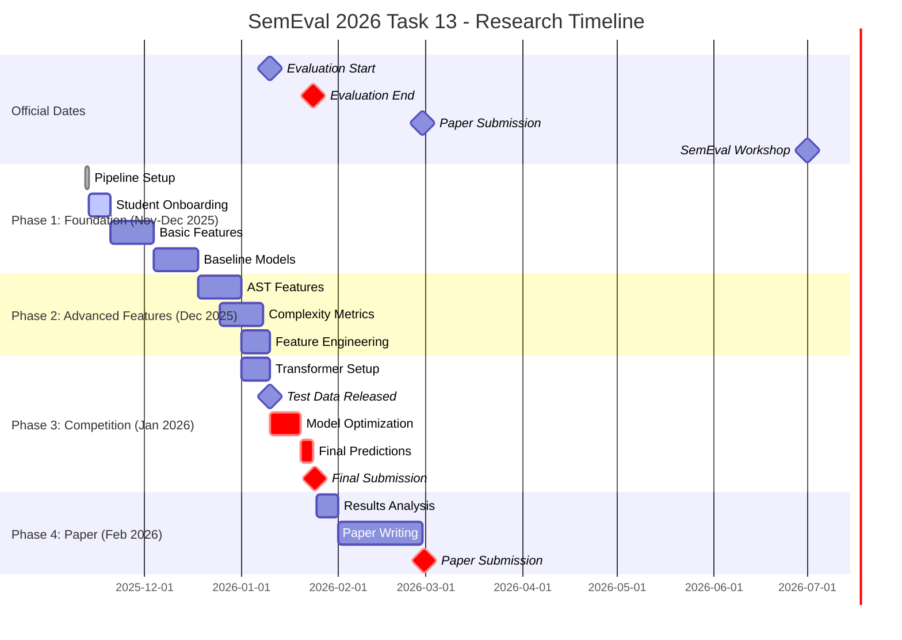
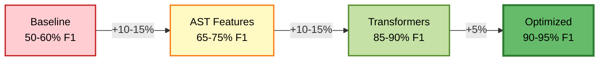

# 🔬 Research Direction

## Primary Research Question

**Can we reliably distinguish AI-generated code from human-written code using machine learning?**

### Sub-Questions
1. What features best discriminate between human and AI code?
2. Do different AI models have distinct coding signatures?
3. Can hybrid (human-edited AI) code be detected?
4. How do models generalize across programming languages?

---

## Research Hypotheses

### H1: Feature Engineering
- **Hypothesis:** Hand-crafted features (AST, complexity, style) can achieve 65-75% F1
- **Rationale:** AI-generated code may have distinct patterns in structure, naming, and complexity
- **Test:** Implement 100+ features, measure individual and combined impact

### H2: Transformer Fine-tuning
- **Hypothesis:** Fine-tuned CodeBERT can achieve 85-95% F1
- **Rationale:** Pre-trained code models capture semantic patterns
- **Test:** Fine-tune CodeBERT, GraphCodeBERT, StarCoder on our dataset

### H3: Hybrid Approaches
- **Hypothesis:** Combining transformers + hand-crafted features outperforms either alone
- **Rationale:** Complementary signal - transformers capture semantics, features capture style
- **Test:** Late fusion, early fusion, and attention-based fusion

### H4: Transfer Learning
- **Hypothesis:** Models trained on Task A transfer to Tasks B and C
- **Rationale:** Detection capability is foundational to classification
- **Test:** Multi-task learning, progressive fine-tuning

---

## Research Roadmap

---

## Performance Milestones

---

## Experimental Plan

### Experiment 1: Feature Ablation Study
- **Goal:** Identify most discriminative features
- **Method:**
  1. Implement 100+ features across categories
  2. Train model with all features
  3. Remove feature groups one at a time
  4. Measure F1 drop to identify importance
- **Expected Outcome:** 5-10 critical features account for 80% of performance

### Experiment 2: Transformer Comparison
- **Goal:** Find best pre-trained model for code detection
- **Method:**
  1. Fine-tune CodeBERT, GraphCodeBERT, CodeT5, StarCoder
  2. Same hyperparameters for fair comparison
  3. Evaluate on validation set
- **Expected Outcome:** GraphCodeBERT performs best due to data flow awareness

### Experiment 3: Hybrid Architecture
- **Goal:** Combine transformers + features optimally
- **Method:**
  1. Late fusion: Average predictions
  2. Early fusion: Concatenate embeddings
  3. Attention fusion: Learn feature weights
- **Expected Outcome:** +2-5% F1 improvement from hybrid approach

### Experiment 4: Data Augmentation
- **Goal:** Increase training data diversity
- **Method:**
  1. Code transformations (variable renaming, formatting changes)
  2. Train with augmented data
  3. Measure generalization on test set
- **Expected Outcome:** +3-7% F1 improvement

---

## Expected Outcomes

| Approach | Expected F1 | Timeline | Difficulty |
|----------|-------------|----------|------------|
| Baseline (Random Forest) | 50-60% | ✅ Done | ⭐ Beginner |
| + Basic Features | 60-65% | Nov 2025 | ⭐ Beginner |
| + AST Features | 65-75% | Dec 2025 | ⭐⭐ Intermediate |
| + Complexity Metrics | 70-80% | Dec 2025 | ⭐⭐ Intermediate |
| CodeBERT Fine-tuned | 85-95% | Jan 2026 | ⭐⭐⭐ Advanced |
| Ensemble + Optimization | 90-95% | Jan 2026 | ⭐⭐⭐ Advanced |

---

## Success Criteria

**Minimum Viable:**
- ✅ 60%+ F1 on Task A (better than random)
- ✅ Working pipeline
- ✅ Reproducible results

**Target:**
- 🎯 70%+ F1 on Task A (competitive)
- 🎯 Published paper at SemEval 2026
- 🎯 Novel insights into AI code detection

**Stretch:**
- 🚀 90%+ F1 on Task A (top-tier)
- 🚀 Generalization across all 3 tasks
- 🚀 State-of-the-art performance

---

For implementation details, see [README.md](README.md)
